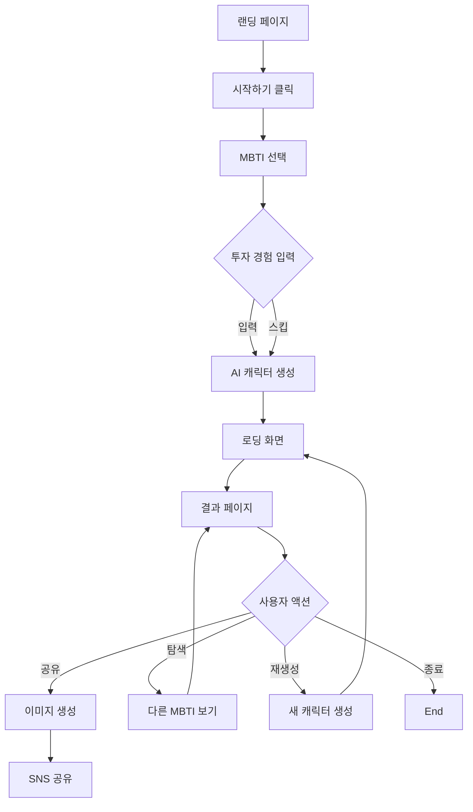

# 서비스 기획서

> **작성일**: 2026-01-15  
> **최종 수정**: 2026-01-15  
> **상태**: 초안  
> **관련 문서**: [00_프로젝트_개요.md](./00_프로젝트_개요.md), [01_비즈니스_요구사항.md](./01_비즈니스_요구사항.md)

---

## 목차
1. [핵심 기능 명세](#1-핵심-기능-명세)
2. [사용자 시나리오](#2-사용자-시나리오)
3. [User Flow](#3-user-flow)
4. [화면 정의서](#4-화면-정의서)
5. [기능 우선순위](#5-기능-우선순위)
6. [인터랙션 설계](#6-인터랙션-설계)

---

## 1. 핵심 기능 명세

### 1.1 MBTI 선택 기능

#### 기능 설명
사용자가 자신의 MBTI 유형을 선택하는 첫 번째 단계

#### 세부 요구사항
```
✅ 16개 MBTI 유형 버튼 제공
   - INTJ, INTP, ENTJ, ENTP
   - INFJ, INFP, ENFJ, ENFP
   - ISTJ, ISFJ, ESTJ, ESFJ
   - ISTP, ISFP, ESTP, ESFP

✅ 각 유형별 간단한 설명 툴팁
   - 호버 시 "전략가", "논리술사" 등 별명 표시

✅ 선택 상태 시각적 피드백
   - 선택된 버튼 하이라이트
   - 부드러운 애니메이션

✅ "내 MBTI 모르겠어요" 링크
   - 16Personalities 외부 링크 제공
```

#### 입력
- 사용자 클릭 이벤트

#### 출력
- 선택된 MBTI 유형 (String)
- 다음 단계로 이동

#### 예외 처리
- 미선택 시 다음 버튼 비활성화

---

### 1.2 투자 경험 입력 (선택 사항)

#### 기능 설명
추가 개인화를 위한 투자 경험 수준 입력

#### 세부 요구사항
```
✅ 3단계 선택지
   - "투자 해본 적 없어요" (초보)
   - "조금 해봤어요" (중급)
   - "자주 해요" (고급)

✅ 스킵 가능
   - "건너뛰기" 버튼 제공
   - 기본값: 초보로 설정

✅ 선택에 따른 설명 톤 조절
   - 초보: 쉬운 용어, 친절한 설명
   - 고급: 간결한 설명, 전문 용어 일부 사용
```

#### 입력
- 투자 경험 수준 (Optional)

#### 출력
- experience_level: "beginner" | "intermediate" | "advanced"

---

### 1.3 AI 캐릭터 생성

#### 기능 설명
MBTI와 투자 경험을 기반으로 AI가 투자 캐릭터 생성

#### 세부 요구사항
```
✅ 생성 항목
   1. 캐릭터 이름 (4-6글자)
      예: "신중한 전략가", "열정적인 모험가"
   
   2. 한 줄 정의 (20자 이내)
      예: "데이터로 승부하는 장기 투자자"
   
   3. 투자 성향 분석 (100-150자)
      - 리스크 성향
      - 의사결정 스타일
      - 선호하는 투자 방식
   
   4. 대표 특징 3가지
      예: "분석적", "인내심", "장기 관점"

✅ 로딩 상태 표시
   - 로딩 애니메이션 (3-5초)
   - "당신의 투자 캐릭터를 생성하고 있어요..." 메시지
   - 진행률 표시 (선택)

✅ 에러 처리
   - AI 생성 실패 시 재시도 버튼
   - 3회 실패 시 기본 캐릭터 제공
```

#### 입력
- MBTI 유형
- 투자 경험 수준 (Optional)

#### 출력
```json
{
  "character_name": "신중한 전략가",
  "tagline": "데이터로 승부하는 장기 투자자",
  "description": "INTJ 성향의 당신은...",
  "traits": ["분석적", "인내심", "장기 관점"],
  "risk_tolerance": "medium",
  "decision_style": "analytical"
}
```

---

### 1.4 맞춤형 주식 추천

#### 기능 설명
사용자의 투자 캐릭터에 맞는 주식 3개 추천

#### 세부 요구사항
```
✅ 추천 개수: 3개
   - 업종 다양성 보장 (최대 2개까지만 같은 업종)
   - 변동성 범위 고려 (리스크 성향 반영)

✅ 각 종목별 정보
   1. 종목명 (한글)
   2. 티커 심볼 (영문)
   3. 업종
   4. 은유적 태그
      예: "불타는 냄비", "천천히 쌓이는 성", "롤러코스터"
   
   5. 추천 이유 (100자 이내)
      - MBTI 성향과 연결
      - 은유 설명
      예: "당신의 신중한 성향에 맞는 안정적인 배당주예요.
           마치 천천히 쌓이는 성처럼 꾸준히 성장합니다."

✅ 카드형 UI
   - 3개 카드 가로 스크롤 (모바일)
   - 3개 카드 그리드 (데스크톱)
   - 카드 클릭 시 상세 설명 확장
```

#### 입력
- 투자 캐릭터 정보
- MBTI 프로필

#### 출력
```json
{
  "recommendations": [
    {
      "stock_name": "삼성전자",
      "ticker": "005930",
      "sector": "반도체",
      "metaphor": "천천히 쌓이는 성",
      "reason": "당신의 신중한 성향에 맞는...",
      "volatility": "low",
      "match_score": 0.85
    },
    // ... 2개 더
  ]
}
```

---

### 1.5 은유 기반 설명 생성

#### 기능 설명
주식 특성을 은유로 변환하여 직관적으로 설명

#### 은유 카테고리
```
🔥 고변동성 (High Volatility)
   - "불타는 냄비"
   - "롤러코스터"
   - "폭풍우 속 항해"

🏰 안정성 (Stability)
   - "천천히 쌓이는 성"
   - "든든한 나무"
   - "거북이의 걸음"

🚀 성장성 (Growth)
   - "로켓 발사"
   - "싹트는 새싹"
   - "날아오르는 독수리"

💎 가치 (Value)
   - "숨겨진 보물"
   - "다이아몬드 원석"
   - "저평가된 명화"

💰 배당 (Dividend)
   - "황금알을 낳는 거위"
   - "꾸준한 월급쟁이"
   - "나무에서 떨어지는 열매"
```

#### 세부 요구사항
```
✅ MBTI 성향 반영
   - INTJ: 분석적 은유 ("체스판의 전략")
   - ENFP: 감성적 은유 ("모험의 시작")

✅ 일관성 유지
   - 같은 종목은 같은 은유 사용 (캐싱)
   - 하지만 설명 문구는 개인화

✅ 부정적 표현 필터링
   - "폭탄", "침몰", "파산" 등 금지어 설정
   - AI 출력 검증 레이어
```

---

### 1.6 결과 공유 기능

#### 기능 설명
생성된 캐릭터 카드를 이미지로 변환하여 SNS 공유

#### 세부 요구사항
```
✅ 이미지 생성
   - html2canvas 라이브러리 사용
   - 해상도: 1200x630 (OG 이미지 표준)
   - 배경: 그라데이션 또는 단색

✅ 이미지 내용
   - 캐릭터 이름
   - 한 줄 정의
   - 대표 특징 3가지
   - 추천 종목 1개 (대표)
   - 워터마크: "MBTI 투자 캐릭터 생성기"

✅ 공유 옵션
   - 이미지 다운로드 (PNG)
   - 카카오톡 공유
   - 트위터 공유
   - 페이스북 공유
   - URL 복사

✅ OG 태그 설정
   - 동적 메타 태그 생성
   - 미리보기 최적화
```

#### 입력
- 캐릭터 정보
- 추천 종목 정보

#### 출력
- 이미지 파일 (PNG, base64)
- 공유 URL

---

### 1.7 다른 MBTI 탐색

#### 기능 설명
다른 MBTI 유형의 투자 캐릭터 확인

#### 세부 요구사항
```
✅ 16개 유형 그리드 표시
   - 각 유형별 대표 캐릭터 이름
   - 클릭 시 해당 유형 결과 표시

✅ 비교 기능 (Optional)
   - 내 유형 vs 다른 유형
   - 차이점 하이라이트

✅ 재생성 버튼
   - "내 캐릭터 다시 만들기"
   - 새로운 은유와 설명 생성
```

---

## 2. 사용자 시나리오

### 시나리오 1: 투자 초보 지민의 여정

```
👤 지민 (27세, ENFP, 투자 경험 없음)

1. SNS에서 친구가 공유한 링크 클릭
   💭 "오, MBTI로 투자 성향 알아보는 거네? 재밌겠다!"

2. 랜딩 페이지 도착
   💭 "디자인 예쁘네. 간단해 보여서 좋아"
   ✅ "시작하기" 버튼 클릭

3. MBTI 선택
   💭 "나는 ENFP지!"
   ✅ ENFP 버튼 클릭

4. 투자 경험 입력
   💭 "투자 해본 적 없는데... 솔직하게 선택"
   ✅ "투자 해본 적 없어요" 선택

5. 로딩 화면 (3초)
   💭 "오 뭔가 만들어지고 있어!"
   👀 로딩 애니메이션 관찰

6. 결과 확인
   💭 "열정적인 모험가? 딱 나네 ㅋㅋ"
   👀 캐릭터 설명 읽기
   👀 추천 주식 3개 확인
   💭 "롤러코스터? 이게 뭐지?"
   ✅ 카드 클릭해서 상세 설명 읽기

7. 공유
   💭 "친구들한테 자랑해야지!"
   ✅ 카카오톡 공유 버튼 클릭
   ✅ 친구 3명에게 전송

8. 재탐색
   💭 "INTJ는 어떨까?"
   ✅ 다른 유형 탐색
   👀 비교하며 재미있어함

결과: ✅ 완료, ✅ 공유, ✅ 재방문 의향
```

---

### 시나리오 2: 투자 경험자 민수의 여정

```
👤 민수 (32세, INTJ, 투자 경험 2년)

1. 커뮤니티에서 링크 발견
   💭 "MBTI로 투자? 좀 유치한데... 그래도 궁금하네"

2. 랜딩 페이지
   💭 "엔터테인먼트 목적이라고 명시했네. 괜찮아"
   ✅ 시작

3. MBTI 선택
   ✅ INTJ 선택

4. 투자 경험
   ✅ "자주 해요" 선택

5. 결과 확인
   💭 "신중한 전략가... 맞는 말이긴 한데"
   👀 추천 종목 확인
   💭 "삼성전자, 현대차... 무난하네"
   💭 "은유 표현은 재미있네. 천천히 쌓이는 성 ㅋㅋ"

6. 비공유
   💭 "공유는 안 할래. 좀 부끄러워"
   ✅ 그냥 결과만 확인하고 종료

7. 피드백
   💭 "생각보다 괜찮았어. 투자 입문자한테 좋을 듯"

결과: ✅ 완료, ❌ 공유, ⭕ 재방문 가능성 낮음
```

---

## 3. User Flow

### 3.1 전체 플로우 다이어그램



### 3.2 상세 플로우

#### Step 1: 랜딩 페이지
```
화면 구성:
- 히어로 섹션: "MBTI로 알아보는 나의 투자 캐릭터"
- 서비스 설명 (3줄)
- CTA 버튼: "시작하기"
- 예시 결과 미리보기 (3개 카드)

사용자 액션:
✅ 시작하기 클릭 → MBTI 선택 페이지
✅ 스크롤 → 서비스 소개 읽기
```

#### Step 2: MBTI 선택
```
화면 구성:
- 진행률 표시: "1/2"
- 질문: "당신의 MBTI는 무엇인가요?"
- 16개 버튼 (4x4 그리드)
- "내 MBTI 모르겠어요" 링크

사용자 액션:
✅ MBTI 버튼 클릭 → 선택 상태 변경
✅ 다음 버튼 클릭 → 투자 경험 입력
✅ "모르겠어요" 클릭 → 외부 링크
```

#### Step 3: 투자 경험 입력
```
화면 구성:
- 진행률: "2/2"
- 질문: "투자 경험이 있으신가요?"
- 3개 선택지 (라디오 버튼)
- 건너뛰기 버튼

사용자 액션:
✅ 선택지 클릭 → 선택 상태 변경
✅ 다음 버튼 → AI 생성 시작
✅ 건너뛰기 → 기본값으로 AI 생성
```

#### Step 4: 로딩 화면
```
화면 구성:
- 로딩 애니메이션 (스피너 또는 프로그레스 바)
- 메시지: "당신의 투자 캐릭터를 생성하고 있어요..."
- 예상 시간: "약 3-5초 소요"

백엔드 처리:
1. MBTI 프로필 로드
2. LLM API 호출
3. 주식 추천 알고리즘 실행
4. 결과 생성

에러 처리:
❌ API 실패 → 재시도 버튼
❌ 3회 실패 → 기본 캐릭터 제공
```

#### Step 5: 결과 페이지
```
화면 구성:
- 캐릭터 카드
  - 캐릭터 이름
  - 한 줄 정의
  - 상세 설명
  - 대표 특징 3가지

- 추천 주식 섹션
  - 3개 카드 (가로 스크롤)
  - 각 카드: 종목명, 은유 태그, 간단 설명
  - 클릭 시 상세 설명 확장

- 액션 버튼
  - 공유하기
  - 다른 MBTI 보기
  - 다시 만들기

사용자 액션:
✅ 주식 카드 클릭 → 상세 설명 모달
✅ 공유 버튼 → 공유 옵션 표시
✅ 다른 MBTI → 탐색 페이지
✅ 다시 만들기 → 새 캐릭터 생성
```

---

## 4. 화면 정의서

### 4.1 랜딩 페이지

#### 레이아웃
```
┌─────────────────────────────────────┐
│         Navigation Bar              │
├─────────────────────────────────────┤
│                                     │
│         Hero Section                │
│   "MBTI로 알아보는 나의 투자 캐릭터"   │
│                                     │
│      [시작하기 버튼]                  │
│                                     │
├─────────────────────────────────────┤
│                                     │
│      서비스 소개 섹션                 │
│   - 3가지 핵심 기능                  │
│   - 예시 결과 미리보기                │
│                                     │
├─────────────────────────────────────┤
│         Footer                      │
└─────────────────────────────────────┘
```

#### 주요 요소
- **히어로 타이틀**: 48px, Bold, 중앙 정렬
- **CTA 버튼**: 큰 사이즈, 눈에 띄는 색상
- **예시 카드**: 3개, 호버 효과

---

### 4.2 MBTI 선택 페이지

#### 레이아웃
```
┌─────────────────────────────────────┐
│   진행률: ●○                         │
├─────────────────────────────────────┤
│                                     │
│   당신의 MBTI는 무엇인가요?           │
│                                     │
│   ┌────┬────┬────┬────┐            │
│   │INTJ│INTP│ENTJ│ENTP│            │
│   ├────┼────┼────┼────┤            │
│   │INFJ│INFP│ENFJ│ENFP│            │
│   ├────┼────┼────┼────┤            │
│   │ISTJ│ISFJ│ESTJ│ESFJ│            │
│   ├────┼────┼────┼────┤            │
│   │ISTP│ISFP│ESTP│ESFP│            │
│   └────┴────┴────┴────┘            │
│                                     │
│   내 MBTI 모르겠어요 →               │
│                                     │
│              [다음]                  │
└─────────────────────────────────────┘
```

#### 인터랙션
- 버튼 호버: 툴팁 표시 ("전략가")
- 버튼 클릭: 선택 상태 (배경색 변경)
- 다음 버튼: 선택 전 비활성화

---

### 4.3 결과 페이지

#### 레이아웃 (데스크톱)
```
┌─────────────────────────────────────┐
│                                     │
│   ┌─────────────────────────────┐  │
│   │   캐릭터 카드                 │  │
│   │                              │  │
│   │   신중한 전략가               │  │
│   │   데이터로 승부하는 장기 투자자│  │
│   │                              │  │
│   │   [분석적] [인내심] [장기관점]│  │
│   └─────────────────────────────┘  │
│                                     │
│   추천 주식                          │
│   ┌────────┬────────┬────────┐     │
│   │ 삼성전자 │ 현대차  │ 카카오 │     │
│   │ 🏰     │ 🚀    │ 💎    │     │
│   │ 천천히  │ 로켓   │ 숨겨진 │     │
│   │ 쌓이는성│ 발사   │ 보물   │     │
│   └────────┴────────┴────────┘     │
│                                     │
│   [공유하기] [다른 MBTI] [다시하기]  │
└─────────────────────────────────────┘
```

---

## 5. 기능 우선순위

### 5.1 MoSCoW 분석

#### Must Have (필수 - Phase 1)
- ✅ MBTI 선택 UI
- ✅ 기본 캐릭터 생성 (AI 없이 룰 기반)
- ✅ 주식 추천 (더미 데이터)
- ✅ 결과 페이지 UI

#### Should Have (중요 - Phase 2)
- ✅ AI 캐릭터 생성 (LLM 연동)
- ✅ 은유 기반 설명
- ✅ 이미지 생성 및 다운로드
- ✅ 기본 공유 기능 (URL 복사)

#### Could Have (선택 - Phase 3)
- ⭕ SNS 공유 버튼 (카카오톡, 트위터)
- ⭕ 투자 경험 입력
- ⭕ 다른 MBTI 탐색
- ⭕ 캐릭터 재생성

#### Won't Have (제외)
- ❌ 사용자 계정 시스템
- ❌ 실시간 주가 정보
- ❌ 포트폴리오 관리
- ❌ 커뮤니티 기능

---

## 6. 인터랙션 설계

### 6.1 애니메이션

#### 페이지 전환
```css
/* 부드러운 페이드 인 */
.page-enter {
  opacity: 0;
  transform: translateY(20px);
}

.page-enter-active {
  opacity: 1;
  transform: translateY(0);
  transition: all 0.3s ease-out;
}
```

#### 버튼 호버
```css
/* 스케일 업 효과 */
.mbti-button:hover {
  transform: scale(1.05);
  box-shadow: 0 4px 12px rgba(0,0,0,0.15);
  transition: all 0.2s ease;
}
```

#### 카드 확장
```css
/* 아코디언 효과 */
.stock-card.expanded {
  height: auto;
  transition: height 0.3s ease;
}
```

### 6.2 피드백

#### 로딩 상태
- 스피너 + 텍스트
- 진행률 표시 (Optional)
- 예상 시간 안내

#### 성공 상태
- 체크마크 아이콘
- "생성 완료!" 메시지
- 부드러운 페이드 인

#### 에러 상태
- 경고 아이콘
- 에러 메시지
- 재시도 버튼

---

## 📚 관련 문서

- [03_기술_명세서.md](./03_기술_명세서.md) - 구현 방법
- [06_UI_UX_가이드.md](./06_UI_UX_가이드.md) - 디자인 시스템
- [07_구현_계획.md](./07_구현_계획.md) - 개발 일정

---

## 📝 변경 이력

| 날짜 | 버전 | 변경 내용 | 작성자 |
|------|------|-----------|--------|
| 2026-01-15 | 0.1 | 초안 작성 | - |
