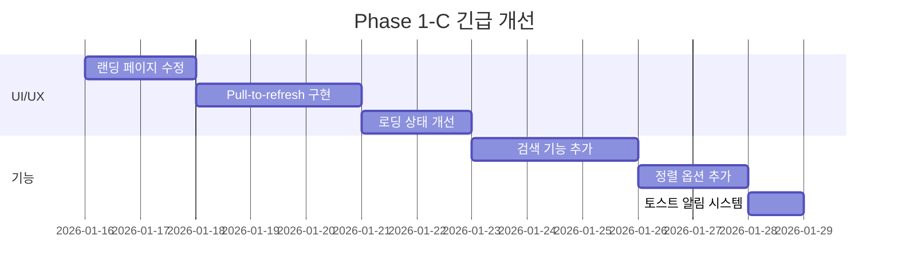
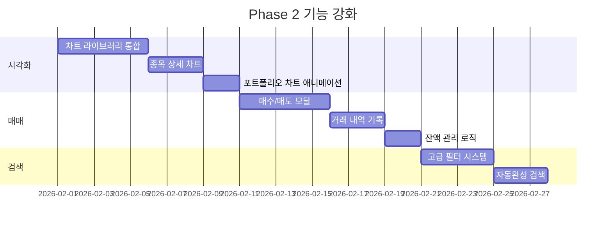
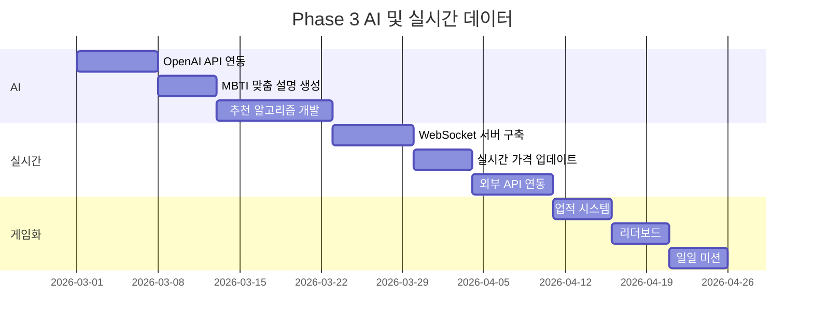
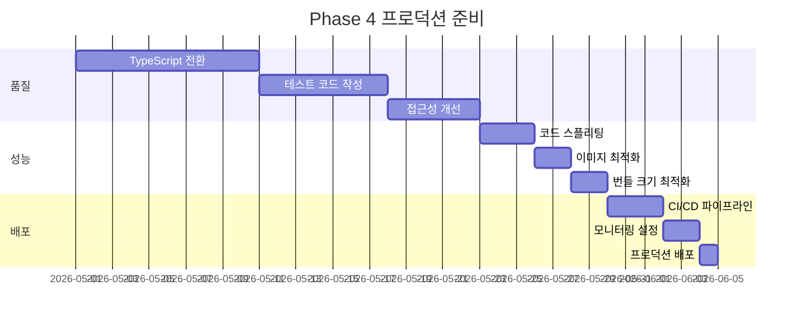

# MBTI 투자 캐릭터 생성기 - 개선 및 고도화 전략

> 작성일: 2026-01-16  
> 버전: Phase 1 완료 시점  
> 분석 범위: 전체 애플리케이션 아키텍처, UI/UX, 기능, 기술 스택

---

## 📋 목차

1. [현재 상태 종합 평가](#1-현재-상태-종합-평가)
2. [핵심 개선 전략](#2-핵심-개선-전략)
3. [고도화 로드맵](#3-고도화-로드맵)
4. [기술 스택 업그레이드](#4-기술-스택-업그레이드)
5. [비즈니스 확장 전략](#5-비즈니스-확장-전략)
6. [실행 계획](#6-실행-계획)

---

## 1. 현재 상태 종합 평가

### 1.1 프로젝트 현황

```
진행률: ████████████░░░░░░░░ 60%
```

| 영역              | 완성도 | 평가                 |
| ----------------- | ------ | -------------------- |
| **기획 & 문서화** | 100%   | ⭐⭐⭐⭐⭐ 매우 우수 |
| **데이터 준비**   | 80%    | ⭐⭐⭐⭐ 우수        |
| **UI/UX 구현**    | 75%    | ⭐⭐⭐⭐ 우수        |
| **핵심 기능**     | 60%    | ⭐⭐⭐ 양호          |
| **성능 최적화**   | 40%    | ⭐⭐ 개선 필요       |
| **접근성**        | 30%    | ⭐⭐ 개선 필요       |
| **테스트**        | 0%     | ❌ 미구현            |

### 1.2 강점 (Strengths)

#### 🎨 **탁월한 UI/UX 디자인**

- 일관된 다크 테마 시스템
- MBTI별 16가지 그라데이션 색상 체계
- Framer Motion 기반 부드러운 애니메이션
- 모바일 최적화된 레이아웃

#### 📊 **풍부한 데이터 자산**

- 16개 MBTI 프로필 (완성)
- 80개 투자 테마 (완성)
- 144개 MBTI 코멘트 (완성)
- 50개 주식 데이터 (샘플)

#### 🏗️ **견고한 아키텍처**

- 명확한 컴포넌트 분리 (common/features/layout)
- Custom Hooks 활용 (useMBTI, usePortfolio, useSettings)
- LocalStorage 기반 상태 관리
- React Router 기반 라우팅

#### 📚 **체계적인 문서화**

- VIBE_CODING 템플릿 적용
- 상세한 기획 문서 (6개 핵심 문서)
- 와이어프레임 및 디자인 가이드

### 1.3 약점 (Weaknesses)

#### ⚠️ **기능적 제약**

- 정적 데이터만 사용 (실시간 주가 미지원)
- 실제 매매 기능 없음 (시뮬레이션만)
- 검색 기능 부재
- 알림 시스템 미구현

#### 🔧 **기술적 부채**

- 대형 컴포넌트 (MainPage 345줄, PortfolioPage 316줄)
- 하드코딩된 값 (초기 자산, 게시글 수)
- 타입 안전성 부족 (JavaScript)
- 테스트 코드 없음

#### 🎯 **사용성 이슈**

- 랜딩 페이지 첫 화면 빈 공간
- Pull-to-refresh 미지원
- 로딩 상태 일부 누락
- 에러 처리 미흡

#### ♿ **접근성 문제**

- ARIA 속성 부족
- 키보드 네비게이션 미흡
- 색상 대비 일부 부족
- 스크린 리더 지원 부족

### 1.4 기회 (Opportunities)

#### 🚀 **시장 기회**

- MZ세대의 MBTI 열풍
- 주식 투자 대중화
- 금융 엔터테인먼트 트렌드
- 개인화 서비스 수요 증가

#### 💡 **기술 확장**

- AI 기반 종목 추천 고도화
- 실시간 데이터 연동
- 소셜 기능 강화
- 게임화(Gamification) 요소 추가

#### 🌐 **비즈니스 모델**

- 프리미엄 기능 (유료 구독)
- 광고 수익 모델
- 증권사 제휴
- 교육 콘텐츠 판매

### 1.5 위협 (Threats)

#### ⚡ **경쟁 환경**

- 기존 증권사 앱의 기능 개선
- 유사 MBTI 투자 서비스 출현
- 금융 규제 강화 가능성

#### 🔒 **기술적 리스크**

- 실시간 데이터 API 비용
- 서버 인프라 필요성
- 보안 및 개인정보 보호

---

## 2. 핵심 개선 전략

### 2.1 즉시 개선 (Quick Wins) - 1-2주

#### 🔴 **Priority 1: 사용자 경험 개선**

##### A. 랜딩 페이지 수정

```javascript
// 문제: 첫 화면 빈 공간
// 해결: Hero 섹션 중앙 배치

<section className="min-h-screen flex items-center justify-center">
  <motion.div
    initial={{ opacity: 0, y: 20 }}
    animate={{ opacity: 1, y: 0 }}
    className="text-center"
  >
    <h1>MBTI로 알아보는 나의 투자 성향</h1>
    <Button>시작하기</Button>
  </motion.div>
</section>
```

##### B. Pull-to-Refresh 구현

```bash
# 이미 설치됨
npm install react-simple-pull-to-refresh
```

**적용 페이지:**

- MainPage (종목 리스트 새로고침)
- CommunityPage (게시글 새로고침)
- PortfolioPage (자산 현황 새로고침)

##### C. 로딩 상태 개선

```javascript
// 스켈레톤 로더 추가
import Skeleton from './components/common/Skeleton'

{
  isLoading ? <Skeleton count={5} height={80} /> : <StockList stocks={stocks} />
}
```

#### 🟡 **Priority 2: 기능 완성도 향상**

##### A. 검색 기능 추가

```javascript
// MainPage에 종목 검색
const [searchQuery, setSearchQuery] = useState('')

const filteredStocks = useMemo(() => {
  return stocks.filter(
    (stock) => stock.name.includes(searchQuery) || stock.ticker.includes(searchQuery)
  )
}, [stocks, searchQuery])
```

##### B. 정렬 옵션 추가

```javascript
// PortfolioPage에 정렬 기능
const sortOptions = [
  { value: 'profit', label: '수익률순' },
  { value: 'amount', label: '금액순' },
  { value: 'name', label: '이름순' },
]
```

##### C. 토스트 알림 시스템

```bash
npm install react-hot-toast
```

```javascript
import toast from 'react-hot-toast'

// 성공 알림
toast.success('종목이 추가되었습니다')

// 에러 알림
toast.error('잔액이 부족합니다')
```

### 2.2 중기 개선 (Feature Enhancement) - 1개월

#### 📊 **차트 시각화 강화**

##### A. 종목 상세 차트 추가

```javascript
import { LineChart, Line, XAxis, YAxis, Tooltip } from 'recharts'

// 7일 가격 추이 차트
;<LineChart data={priceHistory}>
  <Line type="monotone" dataKey="price" stroke="#6366f1" />
  <XAxis dataKey="date" />
  <YAxis />
  <Tooltip />
</LineChart>
```

##### B. 포트폴리오 차트 애니메이션

```javascript
// 원형 차트 진입 애니메이션
<motion.div
  initial={{ scale: 0 }}
  animate={{ scale: 1 }}
  transition={{ type: 'spring', duration: 0.8 }}
>
  <CircularProgress value={stockRatio} />
</motion.div>
```

#### 🎮 **매매 시뮬레이션 구현**

##### A. 매수/매도 모달

```javascript
// BuySellModal.jsx
export default function BuySellModal({ stock, type, onConfirm }) {
  const [quantity, setQuantity] = useState(1)
  const [portfolio, setPortfolio] = usePortfolio()

  const handleBuy = () => {
    const totalCost = stock.price * quantity
    if (portfolio.cash < totalCost) {
      toast.error('잔액이 부족합니다')
      return
    }

    // 포트폴리오 업데이트
    setPortfolio({
      ...portfolio,
      cash: portfolio.cash - totalCost,
      stocks: [...portfolio.stocks, { ...stock, quantity }],
    })

    toast.success(`${stock.name} ${quantity}주 매수 완료`)
  }

  return (
    <Modal>
      <Input type="number" value={quantity} onChange={(e) => setQuantity(e.target.value)} />
      <Button onClick={handleBuy}>매수하기</Button>
    </Modal>
  )
}
```

##### B. 거래 내역 기록

```javascript
// 거래 내역 스키마
{
  id: 'tx-001',
  type: 'buy' | 'sell',
  stock: { ticker, name, price },
  quantity: 10,
  totalAmount: 725000,
  timestamp: '2026-01-16T10:30:00Z'
}
```

#### 🔍 **고급 검색 및 필터**

##### A. 다중 필터 시스템

```javascript
// 업종, 변동성, 배당 등 복합 필터
const [filters, setFilters] = useState({
  sector: [],
  volatility: [],
  dividendYield: { min: 0, max: 10 },
})

const filteredStocks = useMemo(() => {
  return stocks.filter((stock) => {
    if (filters.sector.length && !filters.sector.includes(stock.sector)) {
      return false
    }
    if (filters.volatility.length && !filters.volatility.includes(stock.volatility)) {
      return false
    }
    return true
  })
}, [stocks, filters])
```

##### B. 자동완성 검색

```javascript
import { Combobox } from '@headlessui/react'

;<Combobox value={selected} onChange={setSelected}>
  <Combobox.Input onChange={(e) => setQuery(e.target.value)} />
  <Combobox.Options>
    {filteredStocks.map((stock) => (
      <Combobox.Option key={stock.ticker} value={stock}>
        {stock.name}
      </Combobox.Option>
    ))}
  </Combobox.Options>
</Combobox>
```

### 2.3 장기 개선 (Advanced Features) - 2-3개월

#### 🤖 **AI 기반 개인화**

##### A. GPT 기반 종목 설명 생성

```javascript
// OpenAI API 연동
import OpenAI from 'openai'

const generateMBTIExplanation = async (stock, mbti) => {
  const openai = new OpenAI({ apiKey: process.env.OPENAI_API_KEY })

  const prompt = `
    당신은 ${mbti} 성향의 투자자입니다.
    ${stock.name} 종목을 ${mbti} 관점에서 은유적으로 설명해주세요.
    (예: "천천히 쌓이는 성", "로켓 발사" 등)
  `

  const response = await openai.chat.completions.create({
    model: 'gpt-4',
    messages: [{ role: 'user', content: prompt }],
  })

  return response.choices[0].message.content
}
```

##### B. 추천 알고리즘 고도화

```javascript
// 협업 필터링 기반 추천
const getRecommendations = (userMBTI, userPortfolio) => {
  // 1. 같은 MBTI 사용자들의 포트폴리오 분석
  // 2. 유사도 계산
  // 3. 상위 N개 종목 추천

  return recommendedStocks
}
```

#### 📡 **실시간 데이터 연동**

##### A. WebSocket 기반 실시간 가격

```javascript
import { useEffect, useState } from 'react'

const useRealtimePrice = (ticker) => {
  const [price, setPrice] = useState(null)

  useEffect(() => {
    const ws = new WebSocket(`wss://api.stock.com/ticker/${ticker}`)

    ws.onmessage = (event) => {
      const data = JSON.parse(event.data)
      setPrice(data.price)
    }

    return () => ws.close()
  }, [ticker])

  return price
}
```

##### B. 외부 API 연동

```javascript
// 한국투자증권 API 예시
import axios from 'axios'

const fetchStockPrice = async (ticker) => {
  const response = await axios.get(
    `https://openapi.koreainvestment.com/uapi/domestic-stock/v1/quotations/inquire-price`,
    {
      headers: {
        authorization: `Bearer ${accessToken}`,
        appkey: process.env.KIS_APP_KEY,
        appsecret: process.env.KIS_APP_SECRET,
      },
      params: { FID_INPUT_ISCD: ticker },
    }
  )

  return response.data.output.stck_prpr
}
```

#### 🎯 **게임화(Gamification)**

##### A. 업적 시스템

```javascript
const achievements = [
  {
    id: 'first-trade',
    title: '첫 거래',
    description: '첫 매수를 완료했습니다',
    icon: '🎉',
    reward: 10000,
  },
  {
    id: 'profit-10',
    title: '수익률 10% 달성',
    description: '총 수익률 10%를 달성했습니다',
    icon: '📈',
    reward: 50000,
  },
]

// 업적 달성 체크
const checkAchievements = (portfolio) => {
  const unlockedAchievements = []

  if (portfolio.history.length === 1) {
    unlockedAchievements.push('first-trade')
  }

  const profitRate = calculateProfitRate(portfolio)
  if (profitRate >= 10) {
    unlockedAchievements.push('profit-10')
  }

  return unlockedAchievements
}
```

##### B. 리더보드

```javascript
// 전체 사용자 수익률 순위
const Leaderboard = () => {
  const [rankings, setRankings] = useState([])

  useEffect(() => {
    // Firebase/Supabase에서 전체 사용자 데이터 가져오기
    fetchRankings().then(setRankings)
  }, [])

  return (
    <div>
      {rankings.map((user, index) => (
        <div key={user.id}>
          <span>{index + 1}위</span>
          <span>{user.nickname}</span>
          <span>{user.profitRate}%</span>
        </div>
      ))}
    </div>
  )
}
```

##### C. 일일 미션

```javascript
const dailyMissions = [
  {
    id: 'daily-login',
    title: '오늘의 로그인',
    reward: 5000,
    completed: false,
  },
  {
    id: 'make-trade',
    title: '거래 1회 완료',
    reward: 10000,
    completed: false,
  },
  {
    id: 'community-post',
    title: '커뮤니티 글 작성',
    reward: 15000,
    completed: false,
  },
]
```

---

## 3. 고도화 로드맵

### Phase 1-C: 긴급 개선 (1-2주)



**목표:**

- 사용자 경험 즉시 개선
- 기본 기능 완성도 향상
- 버그 수정

**산출물:**

- ✅ 랜딩 페이지 레이아웃 수정
- ✅ Pull-to-refresh 구현 (3개 페이지)
- ✅ 스켈레톤 로더 추가
- ✅ 검색 기능 (종목/게시글)
- ✅ 정렬 옵션 (포트폴리오)
- ✅ 토스트 알림 시스템

### Phase 2: 기능 강화 (1개월)



**목표:**

- 핵심 기능 완성
- 사용자 인터랙션 강화
- 데이터 시각화 개선

**산출물:**

- ✅ Recharts 기반 차트 시스템
- ✅ 매매 시뮬레이션 완성
- ✅ 거래 내역 페이지
- ✅ 고급 검색 및 필터
- ✅ 자동완성 검색

### Phase 3: AI 및 실시간 데이터 (2개월)



**목표:**

- AI 기반 개인화
- 실시간 데이터 연동
- 게임화 요소 추가

**산출물:**

- ✅ GPT 기반 종목 설명 생성
- ✅ 협업 필터링 추천 시스템
- ✅ WebSocket 실시간 가격
- ✅ 한국투자증권 API 연동
- ✅ 업적/리더보드/미션 시스템

### Phase 4: 프로덕션 준비 (1개월)



**목표:**

- 코드 품질 향상
- 성능 최적화
- 프로덕션 배포

**산출물:**

- ✅ TypeScript 100% 전환
- ✅ 테스트 커버리지 80% 이상
- ✅ WCAG AA 접근성 준수
- ✅ Lighthouse 점수 90+ 달성
- ✅ CI/CD 자동화
- ✅ Sentry 에러 모니터링

---

## 4. 기술 스택 업그레이드

### 4.1 현재 스택

```json
{
  "frontend": {
    "framework": "React 19.2.3",
    "bundler": "Vite 7.3.1",
    "styling": "Tailwind CSS 4.1.18",
    "animation": "Framer Motion 12.26.2",
    "routing": "React Router 7.12.0",
    "charts": "Recharts 3.6.0"
  },
  "state": {
    "local": "LocalStorage",
    "hooks": "Custom Hooks"
  },
  "language": "JavaScript"
}
```

### 4.2 권장 업그레이드

#### A. TypeScript 전환

**장점:**

- 타입 안전성 확보
- IDE 자동완성 개선
- 런타임 에러 사전 방지
- 코드 가독성 향상

**마이그레이션 계획:**

```bash
# 1. TypeScript 설치
npm install -D typescript @types/react @types/react-dom

# 2. tsconfig.json 생성
npx tsc --init

# 3. 점진적 전환
# - utils/ 먼저 전환
# - hooks/ 전환
# - components/ 전환
# - pages/ 전환
```

**예시:**

```typescript
// Before (JavaScript)
export default function useMBTI() {
  return useLocalStorage(KEYS.MBTI, null)
}

// After (TypeScript)
export default function useMBTI(): [string | null, (value: string | null) => void] {
  return useLocalStorage<string | null>(KEYS.MBTI, null)
}
```

#### B. 상태 관리 라이브러리 도입

**옵션 1: Zustand (권장)**

```bash
npm install zustand
```

```typescript
// stores/portfolioStore.ts
import { create } from 'zustand'
import { persist } from 'zustand/middleware'

interface PortfolioState {
  cash: number
  stocks: Stock[]
  addStock: (stock: Stock, quantity: number) => void
  removeStock: (ticker: string) => void
}

export const usePortfolioStore = create<PortfolioState>()(
  persist(
    (set) => ({
      cash: 10000000,
      stocks: [],
      addStock: (stock, quantity) =>
        set((state) => ({
          cash: state.cash - stock.price * quantity,
          stocks: [...state.stocks, { ...stock, quantity }],
        })),
      removeStock: (ticker) =>
        set((state) => ({
          stocks: state.stocks.filter((s) => s.ticker !== ticker),
        })),
    }),
    { name: 'portfolio-storage' }
  )
)
```

**옵션 2: Jotai**

```bash
npm install jotai
```

```typescript
// atoms/portfolio.ts
import { atom } from 'jotai'
import { atomWithStorage } from 'jotai/utils'

export const portfolioAtom = atomWithStorage('portfolio', {
  cash: 10000000,
  stocks: [],
})
```

#### C. 백엔드 연동 (선택)

**옵션 1: Firebase**

```bash
npm install firebase
```

```typescript
// lib/firebase.ts
import { initializeApp } from 'firebase/app'
import { getFirestore } from 'firebase/firestore'
import { getAuth } from 'firebase/auth'

const firebaseConfig = {
  apiKey: process.env.VITE_FIREBASE_API_KEY,
  authDomain: process.env.VITE_FIREBASE_AUTH_DOMAIN,
  projectId: process.env.VITE_FIREBASE_PROJECT_ID,
}

const app = initializeApp(firebaseConfig)
export const db = getFirestore(app)
export const auth = getAuth(app)
```

**옵션 2: Supabase**

```bash
npm install @supabase/supabase-js
```

```typescript
// lib/supabase.ts
import { createClient } from '@supabase/supabase-js'

export const supabase = createClient(
  process.env.VITE_SUPABASE_URL!,
  process.env.VITE_SUPABASE_ANON_KEY!
)
```

#### D. 테스트 프레임워크

**Vitest + React Testing Library**

```bash
npm install -D vitest @testing-library/react @testing-library/jest-dom
```

```typescript
// __tests__/components/StockCard.test.tsx
import { render, screen } from '@testing-library/react'
import { describe, it, expect } from 'vitest'
import StockCard from '@/components/features/StockCard'

describe('StockCard', () => {
  it('renders stock information correctly', () => {
    const stock = {
      ticker: '005930',
      name: '삼성전자',
      price: 72500,
      changePercent: 2.11,
    }

    render(<StockCard stock={stock} />)

    expect(screen.getByText('삼성전자')).toBeInTheDocument()
    expect(screen.getByText('72,500원')).toBeInTheDocument()
    expect(screen.getByText('+2.11%')).toBeInTheDocument()
  })
})
```

#### E. 린팅 및 포맷팅 강화

```bash
# ESLint + Prettier
npm install -D eslint prettier eslint-config-prettier eslint-plugin-react-hooks

# Husky (Git hooks)
npm install -D husky lint-staged
npx husky install
```

```json
// package.json
{
  "lint-staged": {
    "*.{ts,tsx}": ["eslint --fix", "prettier --write"]
  }
}
```

### 4.3 성능 최적화 도구

#### A. 코드 스플리팅

```typescript
// App.tsx
import { lazy, Suspense } from 'react'

const MainPage = lazy(() => import('./pages/MainPage'))
const CommunityPage = lazy(() => import('./pages/CommunityPage'))
const PortfolioPage = lazy(() => import('./pages/PortfolioPage'))

function App() {
  return (
    <Suspense fallback={<LoadingSpinner />}>
      <Routes>
        <Route path="/main" element={<MainPage />} />
        <Route path="/community" element={<CommunityPage />} />
        <Route path="/portfolio" element={<PortfolioPage />} />
      </Routes>
    </Suspense>
  )
}
```

#### B. 이미지 최적화

```bash
npm install -D vite-plugin-image-optimizer
```

```typescript
// vite.config.ts
import { ViteImageOptimizer } from 'vite-plugin-image-optimizer'

export default defineConfig({
  plugins: [
    ViteImageOptimizer({
      png: { quality: 80 },
      jpeg: { quality: 80 },
      webp: { quality: 80 },
    }),
  ],
})
```

#### C. 번들 분석

```bash
npm install -D rollup-plugin-visualizer
```

```typescript
// vite.config.ts
import { visualizer } from 'rollup-plugin-visualizer'

export default defineConfig({
  plugins: [visualizer({ open: true })],
})
```

---

## 5. 비즈니스 확장 전략

### 5.1 수익화 모델

#### A. 프리미엄 구독 (월 9,900원)

**무료 기능:**

- MBTI 투자 성향 분석
- 5개 테마 추천
- 기본 종목 정보
- 커뮤니티 읽기

**프리미엄 기능:**

- 🔓 무제한 테마 접근 (80개)
- 📊 실시간 주가 데이터
- 🤖 AI 맞춤 종목 추천 (일 10회)
- 📈 고급 차트 및 분석 도구
- 🎯 포트폴리오 백테스팅
- 🔔 가격 알림 (무제한)
- 📱 광고 제거

#### B. 광고 수익

**배너 광고:**

- 랜딩 페이지 하단
- 커뮤니티 게시글 사이

**네이티브 광고:**

- 종목 리스트 사이 삽입
- 테마 추천 사이 삽입

**제휴 마케팅:**

- 증권사 계좌 개설 링크
- 투자 교육 콘텐츠 판매

#### C. B2B 제휴

**증권사 제휴:**

- API 연동 수수료
- 화이트라벨 솔루션 제공
- 고객 유입 수수료

**교육 기관:**

- 투자 교육 콘텐츠 라이선스
- 기업 교육 프로그램

### 5.2 마케팅 전략

#### A. 바이럴 마케팅

**소셜 공유 기능:**

```typescript
// 결과 공유 기능
const shareResult = async () => {
  const shareData = {
    title: `나는 ${mbti} 투자자! 수익률 ${profitRate}%`,
    text: `MBTI 투자 성향 테스트 결과를 확인해보세요!`,
    url: `https://mbti-stock.com/share/${userId}`,
  }

  if (navigator.share) {
    await navigator.share(shareData)
  } else {
    // 폴백: 클립보드 복사
    navigator.clipboard.writeText(shareData.url)
    toast.success('링크가 복사되었습니다')
  }
}
```

**오픈그래프 메타태그:**

```html
<meta property="og:title" content="MBTI 투자 캐릭터 생성기" />
<meta property="og:description" content="나의 MBTI로 알아보는 투자 성향" />
<meta property="og:image" content="https://mbti-stock.com/og-image.png" />
```

#### B. 콘텐츠 마케팅

**블로그 콘텐츠:**

- "INTJ 투자자를 위한 5가지 종목"
- "ENFP는 왜 변동성 높은 주식을 좋아할까?"
- "MBTI별 투자 성공 사례"

**유튜브 콘텐츠:**

- MBTI별 투자 스타일 분석
- 실제 투자자 인터뷰
- 앱 사용 가이드

#### C. 커뮤니티 활성화

**이벤트:**

- 월간 수익률 챌린지
- MBTI별 투자 대회
- 추천 종목 공모전

**리워드:**

- 활동 포인트 시스템
- 레벨 업 보상
- 추천인 보너스

### 5.3 글로벌 확장

#### A. 다국어 지원

```bash
npm install react-i18next i18next
```

```typescript
// i18n/config.ts
import i18n from 'i18next'
import { initReactI18next } from 'react-i18next'

i18n.use(initReactI18next).init({
  resources: {
    ko: { translation: require('./locales/ko.json') },
    en: { translation: require('./locales/en.json') },
    ja: { translation: require('./locales/ja.json') },
  },
  lng: 'ko',
  fallbackLng: 'en',
})
```

#### B. 현지화 전략

**미국 시장:**

- S&P 500 종목 데이터
- 달러 기준 가격 표시
- 미국 투자 문화 반영

**일본 시장:**

- 닛케이 225 종목 데이터
- 엔화 기준 가격 표시
- 일본 투자 문화 반영

---

## 6. 실행 계획

### 6.1 즉시 실행 (이번 주)

#### Day 1-2: 랜딩 페이지 수정

```bash
# 작업 파일
src/pages/LandingPage.jsx
src/pages/landing/HeroSection.jsx
```

**체크리스트:**

- [ ] Hero 섹션 중앙 배치
- [ ] 첫 화면 CTA 버튼 표시
- [ ] 스크롤 유도 애니메이션
- [ ] 로딩 스켈레톤 추가

#### Day 3-5: Pull-to-Refresh

```bash
# 작업 파일
src/pages/MainPage.jsx
src/pages/CommunityPage.jsx
src/pages/PortfolioPage.jsx
```

**체크리스트:**

- [ ] react-simple-pull-to-refresh 설정
- [ ] MainPage 새로고침 로직
- [ ] CommunityPage 새로고침 로직
- [ ] PortfolioPage 새로고침 로직

#### Day 6-7: 검색 및 정렬

```bash
# 작업 파일
src/pages/MainPage.jsx (검색)
src/pages/PortfolioPage.jsx (정렬)
```

**체크리스트:**

- [ ] 검색 입력 컴포넌트
- [ ] 검색 필터 로직
- [ ] 정렬 드롭다운
- [ ] 정렬 로직 구현

### 6.2 단기 목표 (2주)

**Week 1:**

- ✅ 랜딩 페이지 수정
- ✅ Pull-to-refresh 구현
- ✅ 검색/정렬 기능

**Week 2:**

- ✅ 토스트 알림 시스템
- ✅ 스켈레톤 로더
- ✅ 에러 바운더리

### 6.3 중기 목표 (1개월)

**Week 3-4:**

- ✅ 차트 시각화
- ✅ 매매 시뮬레이션
- ✅ 거래 내역

**Week 5-6:**

- ✅ 고급 검색 필터
- ✅ 자동완성
- ✅ 접근성 개선

### 6.4 장기 목표 (3개월)

**Month 2:**

- ✅ AI 기반 추천
- ✅ 실시간 데이터
- ✅ 게임화 요소

**Month 3:**

- ✅ TypeScript 전환
- ✅ 테스트 코드
- ✅ 프로덕션 배포

### 6.5 성공 지표 (KPI)

#### 사용자 지표

- **DAU (일일 활성 사용자)**: 1,000명 (3개월 내)
- **MAU (월간 활성 사용자)**: 10,000명 (6개월 내)
- **재방문율**: 40% 이상
- **평균 세션 시간**: 5분 이상

#### 기술 지표

- **Lighthouse 점수**: 90점 이상
- **테스트 커버리지**: 80% 이상
- **번들 크기**: 500KB 이하
- **First Contentful Paint**: 1.5초 이하

#### 비즈니스 지표

- **전환율 (무료→유료)**: 5% 이상
- **월 구독 수익**: 500만원 (6개월 내)
- **광고 수익**: 월 100만원 (6개월 내)

---

## 📌 결론

### 핵심 요약

이 프로젝트는 **탄탄한 기획과 우수한 UI/UX**를 바탕으로 60% 완성도에 도달했습니다. 다음 단계는:

1. **즉시 개선** (1-2주)

   - 랜딩 페이지 수정
   - Pull-to-refresh 구현
   - 검색/정렬 기능 추가

2. **기능 강화** (1개월)

   - 차트 시각화
   - 매매 시뮬레이션
   - 고급 검색 필터

3. **고도화** (2-3개월)

   - AI 기반 개인화
   - 실시간 데이터 연동
   - 게임화 요소

4. **프로덕션** (1개월)
   - TypeScript 전환
   - 테스트 코드 작성
   - 성능 최적화

### 우선순위

```
🔴 긴급 (1-2주)
├─ 랜딩 페이지 수정
├─ Pull-to-refresh
└─ 검색/정렬

🟡 중요 (1개월)
├─ 차트 시각화
├─ 매매 시뮬레이션
└─ 고급 필터

🟢 장기 (2-3개월)
├─ AI 추천
├─ 실시간 데이터
└─ 게임화
```

### 다음 액션

1. **이번 주 목표**: 랜딩 페이지 수정 + Pull-to-refresh
2. **다음 주 목표**: 검색/정렬 + 토스트 알림
3. **이번 달 목표**: 차트 + 매매 시뮬레이션

---

_작성: Antigravity AI_  
_분석 기준: MBTI 투자 캐릭터 생성기 Phase 1 완료 시점_  
_최종 업데이트: 2026-01-16_
