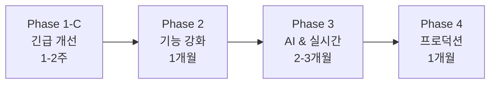

# MBTI 투자 캐릭터 생성기 - 개선 전략 요약

> 📅 2026-01-16  
> 📊 현재 진행률: 60%  
> 🎯 목표: MVP 완성 및 프로덕션 배포

---

## 🎯 핵심 전략 한눈에 보기

### 현재 상태

```
✅ 기획 & 문서화: 100%
✅ 데이터 준비: 80%
✅ UI/UX 구현: 75%
⚠️ 핵심 기능: 60%
⚠️ 성능 최적화: 40%
❌ 테스트: 0%
```

### 3단계 개선 로드맵



---

## 🔴 Phase 1-C: 긴급 개선 (1-2주)

### 즉시 해결할 문제

#### 1. 랜딩 페이지 수정 ⚡

**문제:** 첫 화면이 비어 보임  
**해결:** Hero 섹션을 뷰포트 중앙에 배치

```jsx
<section className="min-h-screen flex items-center justify-center">
  <h1>MBTI로 알아보는 나의 투자 성향</h1>
  <Button>시작하기</Button>
</section>
```

#### 2. Pull-to-Refresh 구현 📱

**적용 페이지:** MainPage, CommunityPage, PortfolioPage

```bash
npm install react-simple-pull-to-refresh
```

#### 3. 검색 기능 추가 🔍

**MainPage:** 종목 검색  
**CommunityPage:** 게시글 검색

#### 4. 정렬 옵션 추가 📊

**PortfolioPage:** 수익률순, 금액순, 이름순

#### 5. 토스트 알림 시스템 🔔

```bash
npm install react-hot-toast
```

### 예상 결과

- ✅ 사용자 경험 즉시 개선
- ✅ 기본 기능 완성도 80% 달성
- ✅ 주요 버그 수정

---

## 🟡 Phase 2: 기능 강화 (1개월)

### 주요 기능

#### 1. 차트 시각화 📈

- 종목 상세 페이지에 7일 가격 추이 차트
- 포트폴리오 원형 차트 애니메이션

```jsx
import { LineChart, Line, XAxis, YAxis } from 'recharts'

;<LineChart data={priceHistory}>
  <Line type="monotone" dataKey="price" stroke="#6366f1" />
</LineChart>
```

#### 2. 매매 시뮬레이션 💰

- 매수/매도 모달
- 거래 내역 기록
- 잔액 관리 로직

```typescript
interface Transaction {
  id: string
  type: 'buy' | 'sell'
  stock: Stock
  quantity: number
  totalAmount: number
  timestamp: string
}
```

#### 3. 고급 검색 필터 🎯

- 업종별 필터
- 변동성 필터
- 배당률 범위 필터
- 자동완성 검색

### 예상 결과

- ✅ 핵심 기능 완성도 90% 달성
- ✅ 사용자 인터랙션 강화
- ✅ 데이터 시각화 개선

---

## 🟢 Phase 3: AI 및 실시간 (2-3개월)

### 고급 기능

#### 1. AI 기반 개인화 🤖

```javascript
// OpenAI API 연동
const generateMBTIExplanation = async (stock, mbti) => {
  const prompt = `
    ${mbti} 성향의 투자자 관점에서
    ${stock.name} 종목을 은유적으로 설명해주세요.
  `

  const response = await openai.chat.completions.create({
    model: 'gpt-4',
    messages: [{ role: 'user', content: prompt }],
  })

  return response.choices[0].message.content
}
```

#### 2. 실시간 데이터 연동 📡

- WebSocket 기반 실시간 가격
- 한국투자증권 API 연동
- 자동 새로고침

#### 3. 게임화 요소 🎮

- **업적 시스템**: 첫 거래, 수익률 10% 달성 등
- **리더보드**: 전체 사용자 수익률 순위
- **일일 미션**: 로그인, 거래, 커뮤니티 활동

### 예상 결과

- ✅ AI 기반 맞춤 추천
- ✅ 실시간 데이터 제공
- ✅ 사용자 참여도 증가

---

## 🔵 Phase 4: 프로덕션 준비 (1개월)

### 품질 향상

#### 1. TypeScript 전환 📘

```bash
npm install -D typescript @types/react @types/react-dom
```

**마이그레이션 순서:**

1. utils/ 전환
2. hooks/ 전환
3. components/ 전환
4. pages/ 전환

#### 2. 테스트 코드 작성 ✅

```bash
npm install -D vitest @testing-library/react
```

**목표:** 테스트 커버리지 80% 이상

#### 3. 성능 최적화 ⚡

- 코드 스플리팅 (React.lazy)
- 이미지 최적화 (WebP)
- 번들 크기 최적화

**목표:** Lighthouse 점수 90점 이상

#### 4. 접근성 개선 ♿

- ARIA 속성 추가
- 키보드 네비게이션
- 색상 대비 개선

**목표:** WCAG AA 준수

### 예상 결과

- ✅ 프로덕션 준비 완료
- ✅ 코드 품질 향상
- ✅ 성능 최적화 완료

---

## 💰 수익화 전략

### 프리미엄 구독 (월 9,900원)

| 기능        | 무료 | 프리미엄     |
| ----------- | ---- | ------------ |
| MBTI 분석   | ✅   | ✅           |
| 테마 추천   | 5개  | 80개         |
| 실시간 주가 | ❌   | ✅           |
| AI 추천     | ❌   | ✅ (일 10회) |
| 고급 차트   | ❌   | ✅           |
| 가격 알림   | 3개  | 무제한       |
| 광고        | 있음 | 없음         |

### 추가 수익원

- 📢 **광고 수익**: 배너, 네이티브 광고
- 🤝 **제휴 수익**: 증권사 계좌 개설 수수료
- 📚 **콘텐츠 판매**: 투자 교육 자료

---

## 📊 성공 지표 (KPI)

### 사용자 지표

```
목표 (6개월 내)
├─ DAU: 1,000명
├─ MAU: 10,000명
├─ 재방문율: 40%
└─ 평균 세션: 5분
```

### 기술 지표

```
목표
├─ Lighthouse: 90점+
├─ 테스트 커버리지: 80%+
├─ 번들 크기: 500KB 이하
└─ FCP: 1.5초 이하
```

### 비즈니스 지표

```
목표 (6개월 내)
├─ 전환율: 5%
├─ 구독 수익: 월 500만원
└─ 광고 수익: 월 100만원
```

---

## 🗓️ 주간 실행 계획

### Week 1 (이번 주)

- [ ] 랜딩 페이지 수정
- [ ] Pull-to-refresh 구현 (MainPage)
- [ ] 검색 기능 추가 (MainPage)

### Week 2

- [ ] Pull-to-refresh (CommunityPage, PortfolioPage)
- [ ] 정렬 옵션 (PortfolioPage)
- [ ] 토스트 알림 시스템

### Week 3-4

- [ ] 차트 시각화 (Recharts)
- [ ] 매수/매도 모달
- [ ] 거래 내역 페이지

### Week 5-6

- [ ] 고급 검색 필터
- [ ] 자동완성 검색
- [ ] 접근성 개선

---

## 🎯 우선순위 매트릭스

```
긴급도 ↑
│
│  🔴 즉시 실행        🟡 계획 수립
│  ─────────────────  ─────────────────
│  • 랜딩 페이지 수정   • AI 추천 시스템
│  • Pull-to-refresh   • 실시간 데이터
│  • 검색/정렬 기능    • 게임화 요소
│
│  🟢 여유 있을 때     ⚪ 보류
│  ─────────────────  ─────────────────
│  • 접근성 개선       • 글로벌 확장
│  • 성능 최적화       • B2B 제휴
│  • 테스트 코드       • 오프라인 지원
│
└────────────────────────────────────→ 중요도
```

---

## 📌 핵심 액션 아이템

### 오늘 할 일

1. ✅ 개선 전략 문서 검토
2. 🔲 랜딩 페이지 수정 시작
3. 🔲 Pull-to-refresh 라이브러리 설정

### 이번 주 목표

1. 랜딩 페이지 완성
2. Pull-to-refresh 구현 (MainPage)
3. 검색 기능 추가

### 이번 달 목표

1. Phase 1-C 완료 (긴급 개선)
2. Phase 2 시작 (차트 시각화)
3. 테스트 커버리지 30% 달성

---

## 🚀 다음 단계

### 즉시 시작

```bash
# 1. Pull-to-refresh 설치
npm install react-simple-pull-to-refresh

# 2. 토스트 알림 설치
npm install react-hot-toast

# 3. 개발 서버 실행
npm run dev
```

### 코드 예시

```jsx
// MainPage.jsx - Pull-to-refresh 적용
import PullToRefresh from 'react-simple-pull-to-refresh'

;<PullToRefresh onRefresh={handleRefresh}>
  <StockList stocks={stocks} />
</PullToRefresh>
```

---

## 📚 참고 문서

- [상세 개선 전략](./개선_및_고도화_전략.md)
- [UI/UX 분석 보고서](./보고서.md)
- [프로젝트 진행 상황](../PROGRESS.md)
- [기술 결정 문서](./99_DECISIONS.md)

---

_작성: Antigravity AI_  
_최종 업데이트: 2026-01-16_
